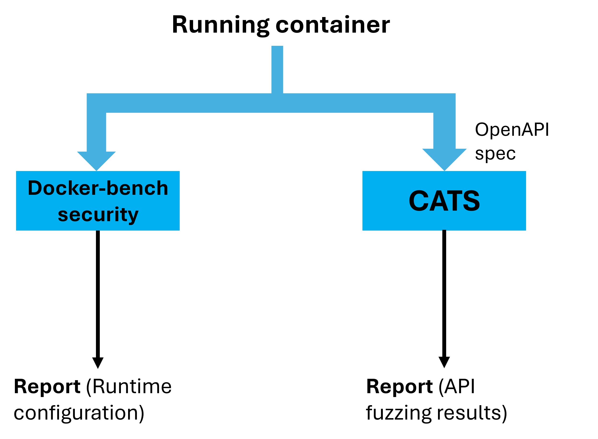
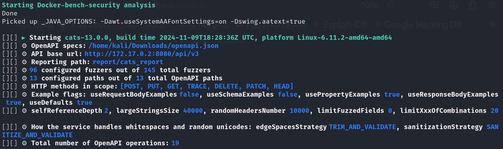
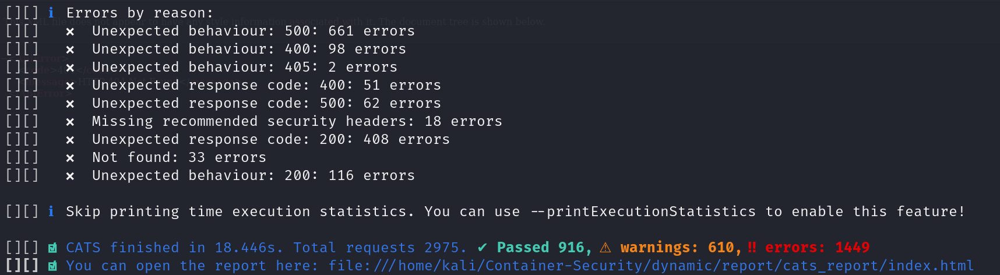
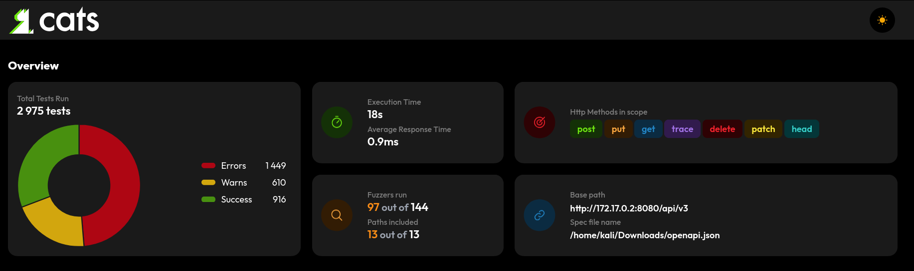
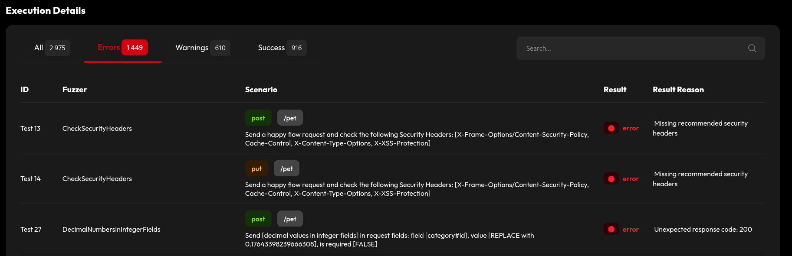

# Dynamic analysis

- [How does it work?](#how-does-it-work)
- [Installation](#Installation)
- [Example](#Example)

# How does it work?
This folder contains a script that performs dynamic analysis on a running container. It leverages docker-bench-security in order to execute the tests from section 5 (Runtime) of the Docker CIS Benchmark and, if an OpenAPI specification is given, it will perform fuzzing on the API with the tool CATS.

</img>

While this analysis might seem somewhat limited, it is difficult to find a general approach since a more detailed study would require a tailored configuration for the application under test and penetration testing activities, but that is out of scope for this project.

# Installation
To install docker-bench-security follow the guide in the static analysis folder.   

CATS is a REST API fuzzer that can be used to find problems in the API configuration. It can be installed either as a binary and as jar; both have been tested and the binary doesn't work on some platforms so just head over to https://github.com/Endava/cats/releases and download the latest uberjar. Once that is done you can simply add cats.jar to this folder or, if you wish to keep it in a separate folder, set the path using the <code>$CATS_PATH</code> environment variable or the <code>--cats_path</code> option.

# Example
For this example too we will use the PetStore demo application. Run the container with:
<pre><code>docker run --name swaggerapi-petstore3 -p 8080:8080 swaggerapi/petstore3:1.0.19</code></pre>

After the container is running we can start the analysis. Download the OpenAPI specification at https://petstore3.swagger.io/api/v3/openapi.json, then run:
<pre><code>python dynamic-analysis.py --name swaggerapi-petstore3 --apispec &lt;path-to&gt;/openapi.json --port 8080 --prefix /api/v3 </code></pre>
Remember to correctly set the CATS path either with the environment variable or command line argument. In this example we are using a prefix (/api/v3) because of way the specification is made.  
The output will be something like this:

 
At the end there will be a summary of the errors and a link you can click to open the CATS report, which you can then navigate:

The output folder will also contain the docker-bench-security report. For a list of all the options use the <code>--help</code> option.
  
As mentioned before, a more accurate analysis would require an appropriate configuration, so if the default settings used by the script are not satisfying you could opt to run CATS separately.
