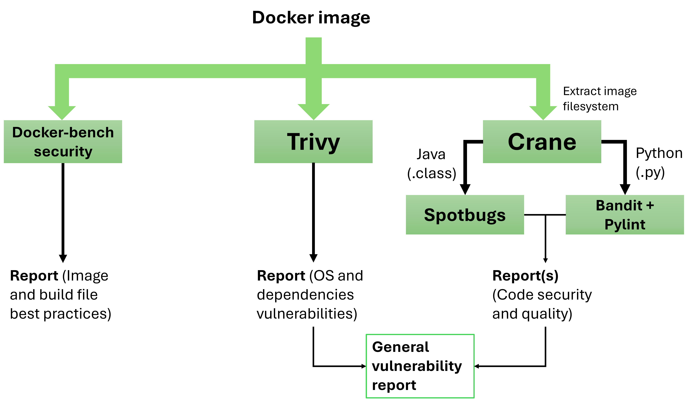
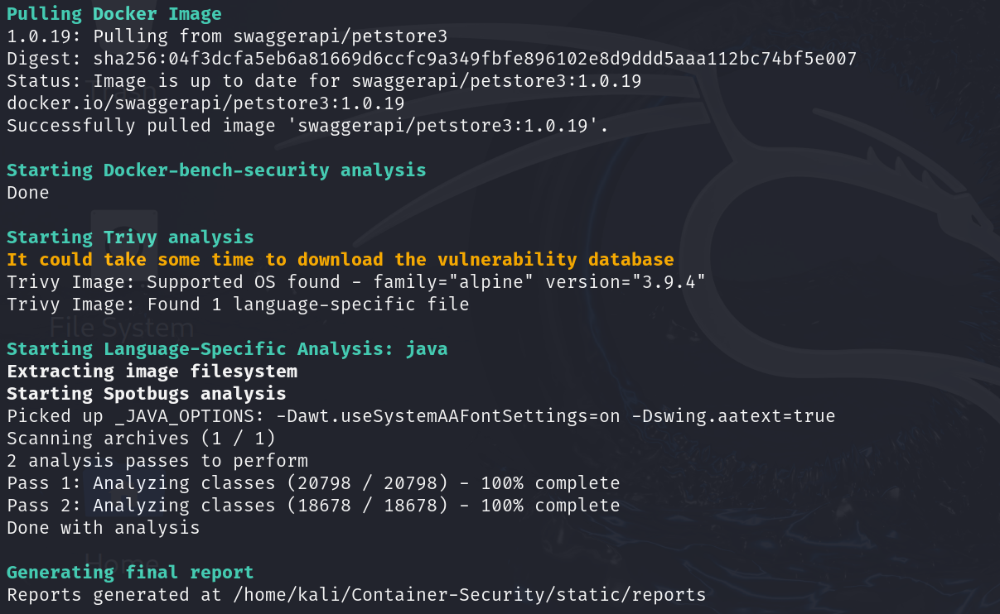
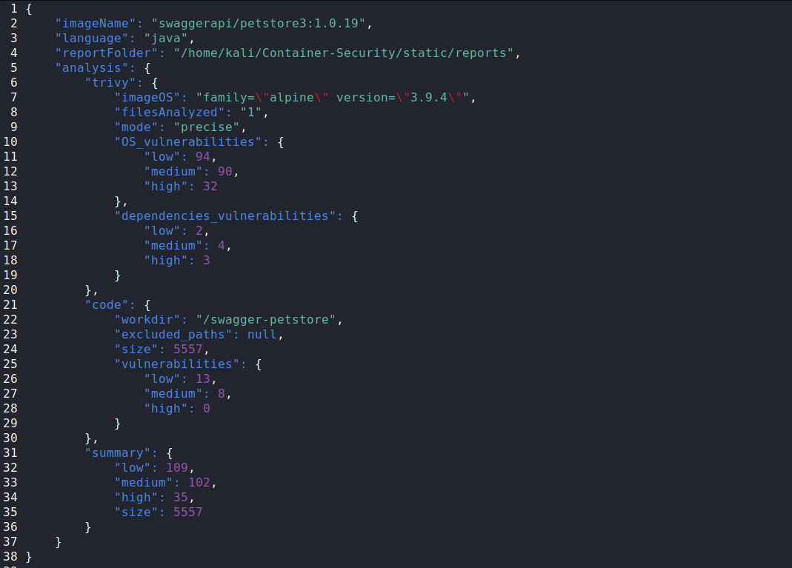

# Static analysis
- [How does it work?](#how-does-it-work)
- [Installation](#Installation)
- [Example](#Example)

# How does it work?
This folder contains a script that performs static analysis on a docker image in order to find vulnerabilities and misconfigurations. Each tool generates an output report, and at the end a general vulnerability report is created from the info acquired during the analysis. The workflow is described in the following image:

</img>

The starting point is a docker image: this can be a local image or one available on Dockerhub.
The first type of analysis is done by docker-bench-security, a tool that performs the checks described in the Docker CIS Benchmark. Specifically, in this section we are running tests from chapter 4 of the Benchmark: Container Images and Build File. 
  
The second analysis is done by Trivy, a tool capable of checking the Image OS and the containerized application itself for vulnerable software packages, dependencies and secrets.
  
Lastly, code analysis. In order for this to work we need to extract the image filesystem, and this is done with Crane. After that, one or more tools are required according to the application language (currently Java and Python are supported). Python analysis requires source (.py) files, while Java analysis works with bytecode, so .classes files or archives containing .class files (jar, ear, war, zip).

# Installation
Besides the tools shown in this section, it is clear that Docker is required, as well as a Java/Python installation depending on the chosen workflow. There are no particular version requirements but it is recommended to download the latest updates.

<h2>Docker-bench-security</h2>
Simply run the following:
<pre><code>git clone https://github.com/docker/docker-bench-security.git</code></pre>
Once it is downloaded, you will have to specify the folder path: this can be done with the <code>$DOCKERBENCH_PATH</code> environment variable or with the <code>--docker_bench_path</code> option.  

<h2>Trivy</h2>
Trivy can be installed in many different ways, but the important part is to add it to <code>$PATH</code> at the end of the installation (so do NOT install it as a container).   
The simplest way to do this is to run the install script:   
<pre><code>curl -sfL https://raw.githubusercontent.com/aquasecurity/trivy/main/contrib/install.sh | sudo sh -s -- -b /usr/local/bin v0.59.0</code></pre>
(maybe replace the version at the end with the most recent one).

  
If this doesn't work or another method is preferred you can check out the official Github repository https://github.com/aquasecurity/trivy for more information.

<h2>Crane</h2>
This is the official Github repository: https://github.com/google/go-containerregistry/tree/main/cmd/crane   

The easiest way to install it is by downloading the latest release and extracting it into <code>$PATH</code>:
<pre><code>VERSION=$(curl -s "https://api.github.com/repos/google/go-containerregistry/releases/latest" | jq -r '.tag_name')</code></pre>
<pre><code>$ OS=Linux       # or Darwin, Windows
$ ARCH=x86_64    # or arm64, x86_64, armv6, i386, s390x
$ curl -sL "https://github.com/google/go-containerregistry/releases/download/${VERSION}/go-containerregistry_${OS}_${ARCH}.tar.gz" > go-containerregistry.tar.gz</code></pre>
<pre><code>tar -zxvf go-containerregistry.tar.gz -C /usr/local/bin/ crane</code></pre>

<h2>Spotbugs (Java analysis)</h2>
Spotbugs is a program to find bugs in Java applications. It is packed as a .jar, so just head over to https://spotbugs.readthedocs.io/en/latest/installing.html and download the latest release.
After that, as seen with docker-bench-security, specify the path to the folder containing the .jar file either with the <code>$SPOTBUGS_PATH</code> env variable or with the <code>--spotbugs_path</code> option.

<h2>Pylint and Bandit (Python analysis)</h2>
Pylint is a code analyser for Python: it checks for errors and code smells. Bandit is focused on security problems.   
To install both simply run:
<pre><code>pip install pylint bandit</code></pre>

Alternatively, check out the official documentation:  
https://pylint.readthedocs.io/en/latest/user_guide/installation/index.html  
https://bandit.readthedocs.io/en/latest/start.html

# Example
This section contains a usage example and an explanation of some command line arguments; for the full list run the script with 
<code>--help</code> .

 
For the test we are going to use the PetStore demo application from Swagger. After the setup of the required tools (Java workflow) start the analysis with the following:
<pre><code>python static-analysis.py --lang java --image swaggerapi/petstore3:1.0.19</code></pre>

The output you are going to see is something like this:
</img>
 
The first thing the script does is pulling the docker image; if you wish to skip this step you can use <code>--local</code> so that it will only look for a local image. Then it starts the analysis with docker-bench-security, Trivy and Spotbugs. (NOTE: If you see an error during the download of Trivy vulnerability database just try to relaunch the script, it's annoying but easily fixed.)
  
The report folder (which you can set with <code>--outfolder</code>) will contain the files generated by each of the tools and a general report:
</img>
 
The report contains a summary of the vulnerabilities and a metric called "size", which for Python applications is the total lines of code analyzed, while for Java is the number of classes. The vulnerabilities of the "code" section are computed in the following way: for Java workflows they are the problems reported by Spotbugs in the SECURITY category, while for Python workflows they are the vulnerabilities identified by Bandit (Pylint is not used for this count because it's more focused on code quality than security).
  
Here are some of the other options:
  
You can use <code>--trivy_mode</code> to tell Trivy to work in "precise" or "comprehensive" mode; the latter will try to find more vulnerabilities but could generate more false positives.
  
With regards to code analysis in general, there are a few things to keep in mind; the most important factor for accurate results is to identify the project folder and not analyze system and dependencies files. This can be done in different ways:
 
- First, by default the script tries to locate and exclude all files installed in the container with package managers; this works for the main Linux distributions (Ubuntu, Debian, Redhat, Alpine). If for some reason you wish to include these files in the analysis, use the <code>--include_pkg</code> option.
- Second, the script tries to locate the project directory by pulling the WORKDIR command from the Dockerfile. This approach is not 100% accurate since the workdir doesn't necessarily contain all the application files, and the WORKDIR instruction could be missing altogether, so you can use the <code>--workdir</code> option to explicitly set the code analysis folder.
- Third, you can exclude paths from the analysis with the <code>--exclude</code> option. Note that for Python some folders are excluded by default (env,venv,.env,.venv).

The best approach is to use both <code>--workdir</code> and <code>--exclude</code> if necessary.
  
Lastly, you can use the <code>--cleanup</code> option to delete the image pulled during the analysis; to avoid accidentally deleting local builds, the deletion won't be executed if <code>--local</code> is also used.
